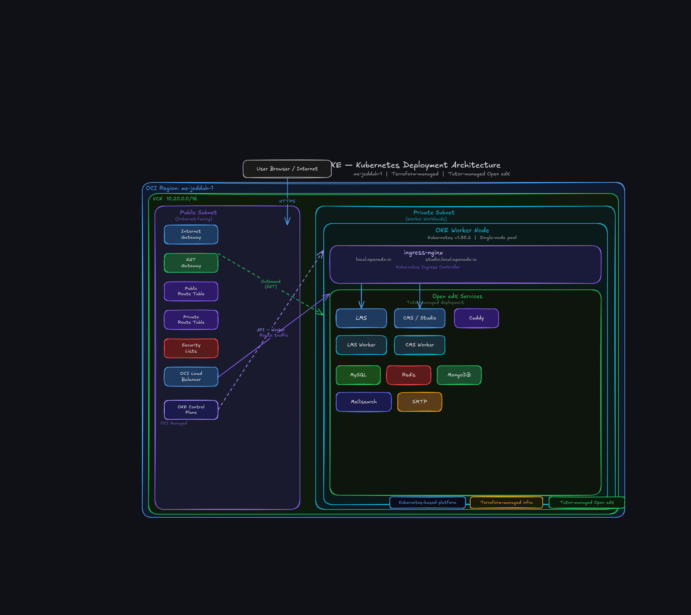
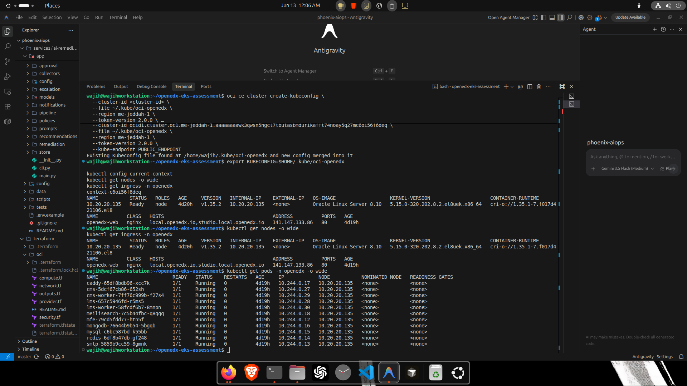
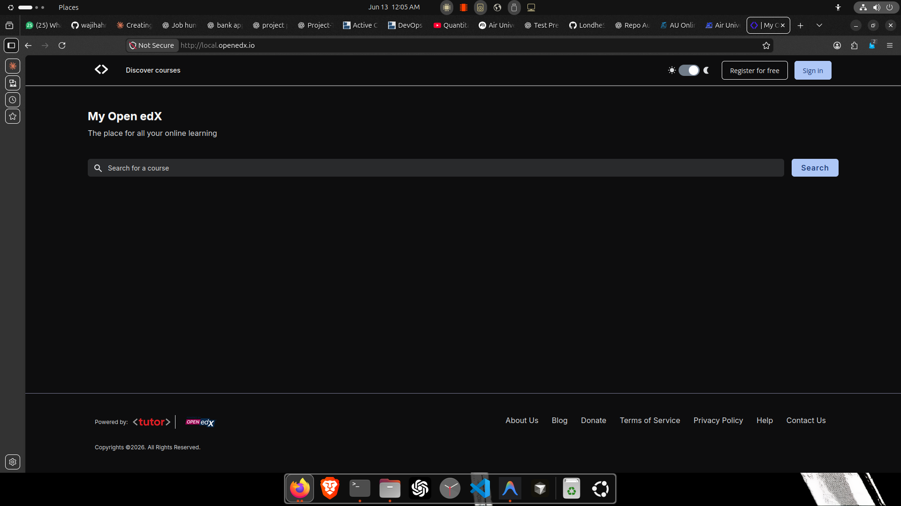

# Open edX on Oracle Kubernetes Engine (OKE)


Terraform-managed Open edX deployment on Oracle Cloud Infrastructure using Oracle Kubernetes Engine, ingress-nginx, and Tutor.

## Project Overview

This project was built as an Al Nafi Open edX deployment assessment to prove that a real Open edX stack can be provisioned and validated on Oracle Cloud Infrastructure with Terraform and Kubernetes.

The goal was to solve a practical deployment problem: bring up OCI networking, OKE, ingress, and the Open edX application stack in a way that could be tested end to end. The result is a working assessment environment with LMS and Studio reachable through ingress.

What was deployed:

* OCI networking and private/public subnet layout
* OKE cluster and one worker node
* ingress-nginx
* Open edX through Tutor
* in-cluster MySQL, Redis, MongoDB, and Meilisearch
* validation evidence captured from the working environment

## Architecture



Environment details:

* OCI region: `me-jeddah-1`
* VCN CIDR: `10.20.0.0/16`
* public subnet: API endpoint and load balancer
* private subnet: OKE worker and Open edX workloads
* NAT gateway: outbound access for worker nodes and cluster workloads
* ingress-nginx: routes traffic to Tutor Caddy and Open edX services

## Tech Stack

| Layer | Technology |
| --- | --- |
| Cloud | Oracle Cloud Infrastructure |
| IaC | Terraform |
| Kubernetes | Oracle Kubernetes Engine |
| Ingress | ingress-nginx + OCI Load Balancer |
| Application | Open edX |
| Deployment Tool | Tutor |
| Data Services | MySQL, Redis, MongoDB, Meilisearch |

## What Was Implemented

* Terraform OCI networking
* OKE cluster
* OKE worker node pool
* ingress-nginx
* Tutor Open edX deployment
* LMS and Studio routing
* in-cluster MySQL, Redis, MongoDB, and Meilisearch
* deployment validation and evidence

## Deployment Workflow

Typical workflow used during the assessment:

```bash
terraform init
terraform plan
terraform apply
```

Generate kubeconfig for the OKE cluster:

```bash
oci ce cluster create-kubeconfig \
  --cluster-id <OKE_CLUSTER_OCID> \
  --file ~/.kube/oci-openedx \
  --region me-jeddah-1 \
  --token-version 2.0.0 \
  --kube-endpoint PUBLIC_ENDPOINT

export KUBECONFIG=$HOME/.kube/oci-openedx
```

Start Tutor-managed Kubernetes services:

```bash
tutor k8s start
tutor k8s init
```

Validation commands:

```bash
kubectl get nodes -o wide
kubectl get pods -n openedx
kubectl get ingress -n openedx
```

## Validation Evidence

### OKE Worker Node



### Open edX Pods


### Ingress


### LMS



### Studio


## Main Debugging Challenge

The hardest issue in this assessment was worker node registration.

The OKE worker node pool was created, but the worker node failed to register with the cluster. CoreDNS remained in `Pending`, and the node pool work request eventually failed with the message: `Work request exceeded max retry count`.

Investigation steps included:

* checking Terraform plan and state
* checking OCI work requests
* checking node pool state
* checking kubeconfig context
* ruling out AWS/EKS context confusion
* checking OKE networking and security list assumptions

Root cause:

The worker node could not complete registration because the required worker-to-API communication was blocked or missing in OCI security list rules.

Fix:

Added the required internal VCN/API communication rules while preserving restricted external API access.

Result:

* worker node joined successfully
* CoreDNS became `Running`
* Open edX workloads scheduled
* LMS and Studio became accessible

## Repository Structure

```text
terraform/
oci/
envs/dev/
modules/vcn/
modules/oke/
tutor-plugins/
docs/
images/
```

## Useful Commands

```bash
export KUBECONFIG=$HOME/.kube/oci-openedx
kubectl get nodes -o wide
kubectl get pods -n openedx
kubectl get ingress -n openedx
terraform plan
tutor k8s start
tutor k8s init
```

Optional cleanup, if needed:

```bash
terraform destroy
```

## Known Limitations

This is assessment-focused, not production HA.

Limitations:

* single worker node
* no autoscaling
* no HA database
* no TLS automation
* no managed database
* local `/etc/hosts` mapping used for test hostnames
* no monitoring stack

## Future Improvements

* DNS automation
* TLS/cert-manager
* managed database
* multi-node worker pool
* CI/CD pipeline
* backup strategy
* monitoring and alerts

## Final Status

* ✅ OCI infrastructure provisioned
* ✅ OKE worker node Ready
* ✅ Open edX deployed
* ✅ LMS accessible
* ✅ Studio accessible
* ✅ ingress-nginx working
* ✅ Terraform-managed infrastructure
* ✅ Deployment evidence captured
